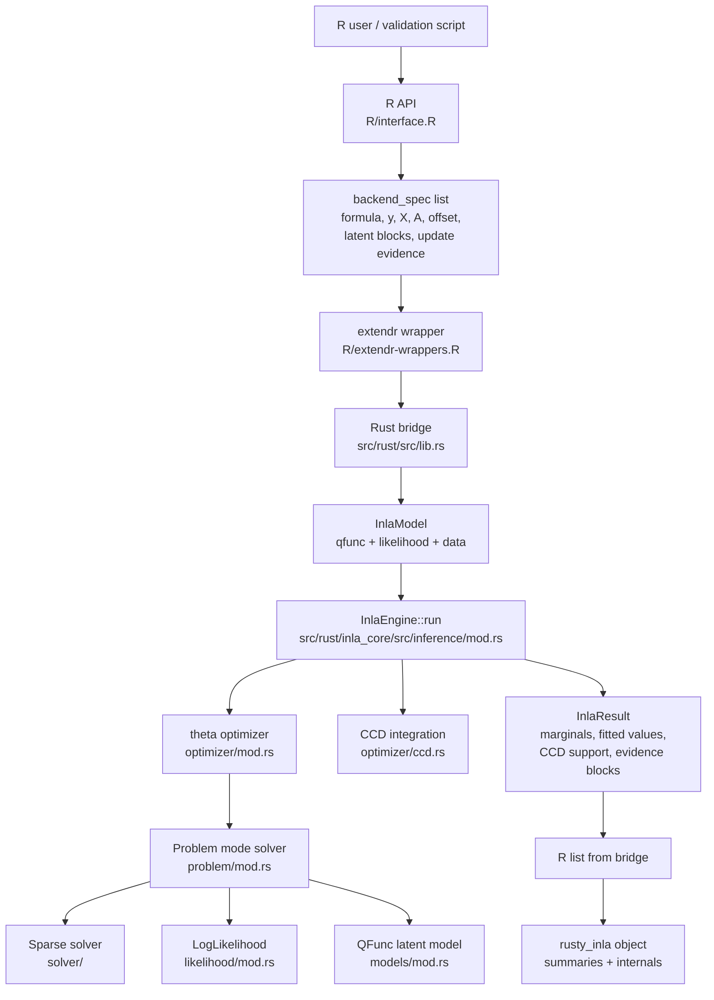
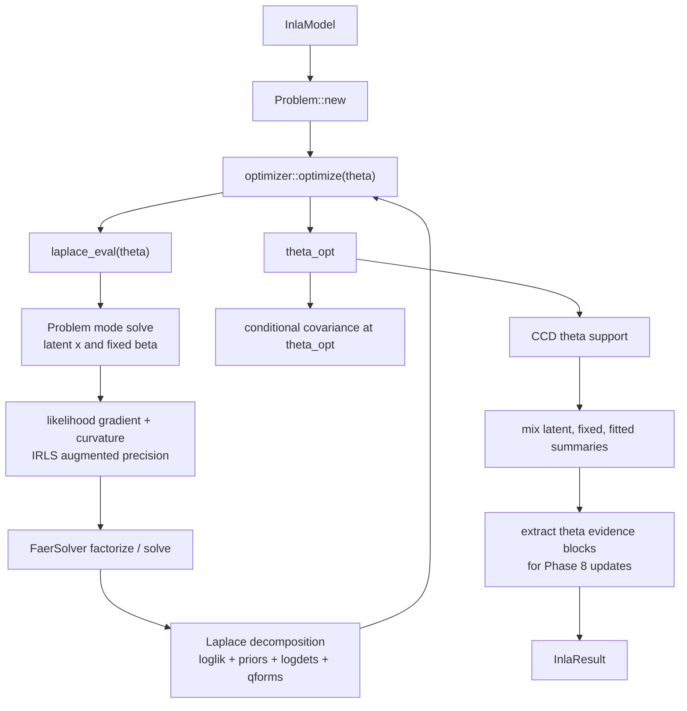
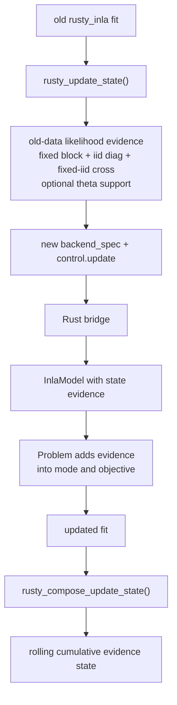

# Core Architecture Map

This note maps how `rustyINLA` is wired today: the R package surface, the
extendr bridge, the Rust inference core, and the validation files around it.

It is meant as a working orientation map for development. For "where do I
touch code when adding a feature?", see
[EXTENSION_INTERVENTION_MAP.md](EXTENSION_INTERVENTION_MAP.md). For the
implemented statistical surface, see
[IMPLEMENTATION_INVENTORY_AND_EXTENSION_GUIDE.md](IMPLEMENTATION_INVENTORY_AND_EXTENSION_GUIDE.md).

## Big Picture



Core idea:

- R owns formula parsing, input validation, and R-shaped output.
- The bridge owns marshaling, registration, and string-to-trait dispatch.
- `inla_core` owns the statistical computation.
- `solver/` owns sparse Cholesky, log determinants, solves, and selected
  inverse.

## Main Runtime Flow

1. User calls `rusty_inla(formula, data, family, ...)`.
2. `R/interface.R` validates the supported formula subset.
3. `build_backend_spec()` creates:
   - response vector `y`
   - dense fixed-effect design matrix `X`
   - sparse observation mapping triplets `A_i`, `A_j`, `A_x`
   - offsets
   - latent block metadata
   - optional constraints
   - optional Phase 8 update-state evidence
4. `rust_inla_run(spec)` calls `.Call(wrap__rust_inla_run, spec)`.
5. `src/rust/src/lib.rs` parses the R list into `BackendSpec`.
6. The bridge selects:
   - a `QFunc` latent model from `latent_blocks`
   - a `LogLikelihood` from `family`
   - default theta initial values
7. The bridge constructs `InlaModel` and calls `InlaEngine::run()`.
8. `InlaEngine` builds a `Problem`, optimizes theta, computes CCD support,
   mixes posterior summaries, and extracts evidence blocks.
9. The bridge converts `InlaResult` into an R list.
10. `R/interface.R` shapes the final `rusty_inla` object:
    - `summary.fixed`
    - `summary.random`
    - `summary.hyperpar`
    - `summary.fitted.values`
    - optional benchmark internals
    - Phase 8 state metadata

## R Package Layer

| File | Role |
| --- | --- |
| [R/interface.R](R/interface.R) | Main R API, formula validation, backend spec builder, output shaping, prediction, Phase 8 update-state extraction/composition. |
| [R/f.R](R/f.R) | User-facing latent term helper `f(covariate, model, constr)`. Supports `iid`, `rw1`, `rw2`, `ar1`, `ar2`. |
| [R/extendr-wrappers.R](R/extendr-wrappers.R) | Generated `.Call()` wrapper for `rust_inla_run()`. |
| [NAMESPACE](NAMESPACE) | Exports `rusty_inla`, `f`, `predict`, print/summary methods, and Phase 8 update helpers. |
| [man/](man) | Generated Rd docs for exported functions. |

Important R responsibilities:

- Reject unsupported formula surfaces before Rust is called.
- Build fixed effects with `model.matrix()`.
- Require transformed fixed effects to be materialized in `data` first.
- Build latent `A` triplets from standalone `f(...)` terms.
- Carry factor levels for rolling `iid` update states, including born and
  dormant levels.
- Convert Rust vectors into R-INLA-like summary tables.

Current public R entrypoints:

- `rusty_inla()`
- `f()`
- `predict.rusty_inla()`
- `rusty_posterior_state()`
- `rusty_update_state()`
- `rusty_compose_update_state()`

## Extendr Bridge Layer

| File | Role |
| --- | --- |
| [src/rust/src/lib.rs](src/rust/src/lib.rs) | Thin bridge between R lists and `inla_core`. Parses `BackendSpec`, validates dimensions, selects model and likelihood implementations, calls `InlaEngine`, returns an R list. |
| [src/rust/Cargo.toml](src/rust/Cargo.toml) | Package-facing Rust crate, `extendr-api` dependency, workspace root, depends on local `inla_core`. |
| [src/entrypoint.c](src/entrypoint.c) | R package compiled entrypoint glue. |
| [src/Makevars.win](src/Makevars.win) and related files | R/Rust build integration, especially Windows. |

Bridge dispatch map:

```text
family string              Rust likelihood
-------------------------------------------------
gaussian                   GaussianLikelihood
poisson                    PoissonLikelihood
gamma                      GammaLikelihood
zeroinflatedpoisson1       ZipLikelihood
tweedie                    TweedieLikelihood

latent model string        Rust QFunc
-------------------------------------------------
iid                        IidModel
rw1                        Rw1Model
rw2                        Rw2Model
ar1                        Ar1Model
ar2                        Ar2Model
multiple blocks            CompoundQFunc
no latent blocks           FixedOnlyModel
```

The bridge should stay boring. Statistical logic belongs in `inla_core`, not
in `src/rust/src/lib.rs`.

## Rust Core Modules

| Module | File | Owns |
| --- | --- | --- |
| crate root | [src/rust/inla_core/src/lib.rs](src/rust/inla_core/src/lib.rs) | Public module list. |
| errors | [error.rs](src/rust/inla_core/src/error.rs) | Shared `InlaError` types. |
| graph | [graph/mod.rs](src/rust/inla_core/src/graph/mod.rs) | Sparse precision graph structure, graph hashes, chain/second-order/generic graph constructors, `A^T A` edge discovery. |
| models | [models/mod.rs](src/rust/inla_core/src/models/mod.rs) | `QFunc` trait and latent GMRF models: fixed-only, `iid`, `rw1`, `rw2`, `ar1`, `ar2`, compound blocks. |
| likelihood | [likelihood/mod.rs](src/rust/inla_core/src/likelihood/mod.rs) | `LogLikelihood` trait, link functions, Gaussian, Poisson, Gamma, ZIP Type-1, experimental Tweedie. |
| problem | [problem/mod.rs](src/rust/inla_core/src/problem/mod.rs) | Latent/fixed mode solves, IRLS, constraints, Schur fixed-effect solves, state evidence injection, selected inverse calls. |
| optimizer | [optimizer/mod.rs](src/rust/inla_core/src/optimizer/mod.rs) | Hyperparameter objective, Laplace decomposition, finite-difference theta gradients, line search, theta mode optimization. |
| CCD | [optimizer/ccd.rs](src/rust/inla_core/src/optimizer/ccd.rs) | Central Composite Design support points, weights, theta Laplace correction, CCD log weights. |
| inference | [inference/mod.rs](src/rust/inla_core/src/inference/mod.rs) | `InlaModel`, `InlaParams`, `InlaResult`, `InlaEngine::run`, posterior mixing, fitted marginals, Phase 8 theta evidence extraction. |
| solver | [solver/mod.rs](src/rust/inla_core/src/solver/mod.rs) | `SparseSolver` trait and solver contract. |
| faer solver | [solver/faer_solver.rs](src/rust/inla_core/src/solver/faer_solver.rs) | Concrete sparse solver using `faer`: build, factorize, log determinant, solve, selected inverse. |
| marginal | [marginal/mod.rs](src/rust/inla_core/src/marginal/mod.rs) | Marginal grid helpers and Gaussian-like marginal summaries. |
| density | [density/mod.rs](src/rust/inla_core/src/density/mod.rs) | Density helpers used by marginal summaries/tests. |
| integrator | [integrator/mod.rs](src/rust/inla_core/src/integrator/mod.rs) | Gauss-Kronrod helper. |
| diagnostics | [diagnostics/mod.rs](src/rust/inla_core/src/diagnostics/mod.rs) | Runtime counters and timing summaries. |

## Key Core Traits

### `LogLikelihood`

Defined in [likelihood/mod.rs](src/rust/inla_core/src/likelihood/mod.rs).

Each family provides:

- pointwise log-likelihood evaluation
- link function
- number of likelihood hyperparameters
- analytic gradient and curvature with respect to the linear predictor
- likelihood hyperprior on the internal theta scale

This is the main hook for Phase 9 distributions such as `nbinomial2`.

### `QFunc`

Defined in [models/mod.rs](src/rust/inla_core/src/models/mod.rs).

Each latent model provides:

- sparse graph pattern
- precision entry evaluation `Q(i, j, theta)`
- number of model hyperparameters
- optional analytic derivatives of precision entries
- proper/improper prior flag
- log determinant scaling term for intrinsic models
- model hyperprior on the internal theta scale

This is the main hook for new latent models and future graph-driven spatial
models.

### `SparseSolver`

Defined in [solver/mod.rs](src/rust/inla_core/src/solver/mod.rs).

The solver contract is:

1. reorder graph
2. build numeric precision matrix
3. factorize
4. compute log determinant
5. solve linear systems
6. optionally compute selected inverse

The current concrete implementation is `FaerSolver`.

## Statistical Engine Flow



The shared engine does not know about R formula syntax. It sees only numeric
arrays and trait objects.

## Data Shapes Crossing the Boundary

`backend_spec` from R to Rust:

| Field group | Meaning |
| --- | --- |
| `y`, `likelihood` | Response vector and family string. |
| `fixed_matrix`, `fixed_names`, `n_fixed` | Dense fixed-effect design matrix in R column-major order. |
| `a_i`, `a_j`, `a_x`, `n_latent` | Sparse observation-to-latent map. |
| `offset` | Combined formula/user offset. |
| `extr_constr`, `n_constr` | Optional extra constraints for intrinsic fields. |
| `latent_blocks` | Model name, level count, start index, level values, structural values. |
| `theta_init`, `latent_init`, `fixed_init` | Optional warm starts/overrides. |
| Phase 8 state fields | Fixed, latent, fixed-latent, and theta-support evidence. |
| optimizer controls | `optimizer_max_evals`, `skip_ccd`. |

`InlaResult` from Rust to R:

| Field group | Meaning |
| --- | --- |
| `theta_opt`, `log_mlik`, CCD fields | Hyperparameter mode, marginal likelihood, theta support and weights. |
| `fixed_means`, `fixed_sds`, covariance fields | Fixed-effect summaries. |
| `random`, `fitted`, eta fields | Latent and predictor/fitted marginal summaries. |
| `theta_evidence_*` | Compact evidence blocks for Phase 8 update states. |
| `mode_*`, `laplace_terms` | Benchmark/debug internals. |
| `diagnostics` | Timings and counters. |

## Phase 8 Update-State Path

The current Phase 8 workflow is implemented mostly in [R/interface.R](R/interface.R)
with numerical support in `inla_core`.



Current restriction:

- one factor `iid` block
- same family
- same fixed-effect column names
- same `iid` covariate name
- born levels get zero old evidence
- dormant factor levels can be carried

The recursive evidence graph roadmap generalizes this from one fixed-plus-`iid`
edge into a block-sparse evidence graph.

## Tests And Validation

| Area | Files |
| --- | --- |
| Rust core tests | [src/rust/inla_core/tests/test_basic.rs](src/rust/inla_core/tests/test_basic.rs) plus module-local tests in `inla_core/src/**/mod.rs`. |
| Fixed effects and formula API | [tests/fixed-effects-interface.R](tests/fixed-effects-interface.R), [tests/fixed-effects-public-api-errors.R](tests/fixed-effects-public-api-errors.R), [tests/fixed-only-parity.R](tests/fixed-only-parity.R). |
| Phase 8 update states | [tests/posterior-state-*.R](tests). |
| Supported subset validation | [tools/run_supported_subset_validation.R](tools/run_supported_subset_validation.R). |
| Phase 7A gate | [tools/run-phase7a-validation.ps1](tools/run-phase7a-validation.ps1). |
| Phase 8 gate | [tools/run-phase8-validation.ps1](tools/run-phase8-validation.ps1). |
| Actuarial Phase 8 diagnostics | [tools/run_phase8_vehbrand_update.R](tools/run_phase8_vehbrand_update.R), [tools/run_phase8_fremtpl_three_part_update.R](tools/run_phase8_fremtpl_three_part_update.R), [tools/run_phase8_fremtpl_born_brand_update.R](tools/run_phase8_fremtpl_born_brand_update.R), [tools/run_phase8_fremtpl_four_part_dormant_brand_update.R](tools/run_phase8_fremtpl_four_part_dormant_brand_update.R). |
| Worktree package loading | [tools/load_worktree_package.R](tools/load_worktree_package.R). |
| Windows/Rust build checks | [tools/check-rust-workspace-win.ps1](tools/check-rust-workspace-win.ps1), [tools/with-r-build-env.ps1](tools/with-r-build-env.ps1). |

## Documentation Map

| File | Purpose |
| --- | --- |
| [README.md](README.md) | Main project status, benchmark snapshot, current roadmap. |
| [CORE_ARCHITECTURE_MAP.md](CORE_ARCHITECTURE_MAP.md) | This architecture and file map. |
| [IMPLEMENTATION_INVENTORY_AND_EXTENSION_GUIDE.md](IMPLEMENTATION_INVENTORY_AND_EXTENSION_GUIDE.md) | Implemented subset and extension difficulty classes. |
| [EXTENSION_INTERVENTION_MAP.md](EXTENSION_INTERVENTION_MAP.md) | Where to touch files for new family/model/API additions. |
| [EXTENSION_BACKLOG.md](EXTENSION_BACKLOG.md) | Recommended order of future work. |
| [CLEAN_ROOM_DISTRIBUTION_ROADMAP.md](CLEAN_ROOM_DISTRIBUTION_ROADMAP.md) | Phase 9 native distribution plan. |
| [PHASE8_ROADMAP.md](PHASE8_ROADMAP.md) | Sequential update and recursive evidence graph roadmap. |
| [POSTERIOR_STATE_UPDATE_RFC.md](POSTERIOR_STATE_UPDATE_RFC.md) | Design notes for posterior/update state semantics. |
| [RINLA_PARITY_GAP_INVENTORY.md](RINLA_PARITY_GAP_INVENTORY.md) | What is missing relative to R-INLA registries. |
| [RINLA_API_SURFACE_INVENTORY.md](RINLA_API_SURFACE_INVENTORY.md) | Public R-INLA API surface notes. |
| [SUPPORTED_SUBSET_VALIDATION_MANIFEST.md](SUPPORTED_SUBSET_VALIDATION_MANIFEST.md) | Supported subset validation contract. |
| [FIXED_EFFECTS_FORMULA_SUBSET.md](FIXED_EFFECTS_FORMULA_SUBSET.md) | Current R formula contract for fixed effects. |
| [EXTERNAL_EXAMPLE_BENCHMARKING_GUIDE.md](EXTERNAL_EXAMPLE_BENCHMARKING_GUIDE.md) | How external examples are used as references. |
| [API_IMPLEMENTATION_QUEUE.md](API_IMPLEMENTATION_QUEUE.md) | API work queue. |
| [AR2_EXTENSION_EXAMPLE.md](AR2_EXTENSION_EXAMPLE.md) | Worked example for adding a latent model. |
| [PROVENANCE.md](PROVENANCE.md) and [THIRD_PARTY.md](THIRD_PARTY.md) | Provenance and third-party dependency notes. |

## Directory Map

```text
rustyINLA/
  R/
    interface.R              main R API and output shaping
    f.R                      latent term helper
    extendr-wrappers.R       .Call wrapper

  src/
    rust/
      src/lib.rs             extendr bridge crate
      Cargo.toml             Rust workspace root/package crate
      inla_core/
        Cargo.toml           reusable Rust inference core
        src/
          graph/             sparse graph patterns
          models/            latent QFunc models
          likelihood/        likelihood families
          problem/           mode solves and evidence injection
          optimizer/         Laplace objective and CCD
          inference/         engine orchestration and summaries
          solver/            sparse solver abstraction and faer backend
          marginal/          marginal summaries
          density/           density helpers
          diagnostics/       timings and counters
          error.rs           errors
        tests/               Rust integration tests

  tests/                     R-level regression and parity tests
  tools/                     validation, build, and benchmark helpers
  scratch/                   diagnostics, generated references, plots, caches
  man/                       generated Rd docs
  .github/workflows/         CI workflow
```

## Development Rules Of Thumb

- New likelihood that fits `p(y_i | eta_i, theta)`: start in
  [likelihood/mod.rs](src/rust/inla_core/src/likelihood/mod.rs), then register
  it in [src/rust/src/lib.rs](src/rust/src/lib.rs).
- New latent model with the current block shape: start in
  [models/mod.rs](src/rust/inla_core/src/models/mod.rs), then expose it in
  [R/f.R](R/f.R) and the bridge.
- New graph-driven model: design the public graph input first, then touch
  `R/interface.R`, `src/rust/src/lib.rs`, `graph/`, and `models/`.
- New multi-predictor family: expect R/backend-spec widening before core math.
- Avoid changing [solver/](src/rust/inla_core/src/solver) unless the sparse
  numerical method itself is the blocker.
- Keep source-code clean-room boundaries for Phase 9 distributions: use public
  formulas and black-box validation, not external implementation code.
