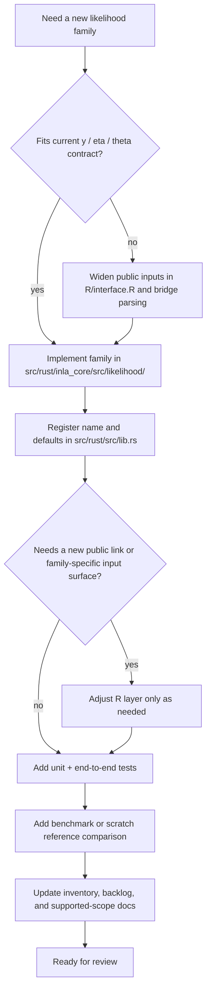

# Extension Intervention Map

This note shows where future work usually lands when extending `rustyINLA`.

Use it as a quick map for "which directories do I touch?" before starting a new family, a new latent model, a new graph-driven model, or a new binding.

For the detailed parity-gap inventory relative to R-INLA, see [RINLA_PARITY_GAP_INVENTORY.md](RINLA_PARITY_GAP_INVENTORY.md).

## 1. High-level intervention diagram

```mermaid
flowchart TD
    request["Future addition"]
    request --> family["New likelihood family"]
    request --> simple_gmrf["New simple GMRF model"]
    request --> graph_gmrf["New graph-driven spatial model"]
    request --> binding["New language binding"]

    subgraph core["Rust core: rustyINLA/src/rust/inla_core/"]
        likelihood["src/likelihood/"]
        models["src/models/"]
        graph["src/graph/"]
        engine["src/problem/ + src/optimizer/ + src/inference/"]
        core_tests["tests/"]
    end

    subgraph bridge["Current R binding crate: rustyINLA/src/rust/"]
        bridge_lib["src/lib.rs"]
        cargo["Cargo.toml"]
    end

    subgraph rlayer["R package layer: rustyINLA/R/"]
        f_layer["f.R"]
        interface_layer["interface.R"]
    end

    subgraph validation["Validation and planning docs"]
        bench["benchmark.R + scratch/"]
        docs["README + Inventory + Backlog + Roadmap"]
    end

    family --> likelihood
    family --> bridge_lib
    family --> core_tests
    family --> bench
    family --> docs

    simple_gmrf --> models
    simple_gmrf --> bridge_lib
    simple_gmrf --> f_layer
    simple_gmrf --> core_tests
    simple_gmrf --> bench
    simple_gmrf --> docs
    simple_gmrf -. "if the sparsity pattern is new" .-> graph

    graph_gmrf --> graph
    graph_gmrf --> models
    graph_gmrf --> bridge_lib
    graph_gmrf --> interface_layer
    graph_gmrf --> core_tests
    graph_gmrf --> bench
    graph_gmrf --> docs

    binding --> cargo
    binding --> docs
    binding -. "reuse core logic" .-> likelihood
    binding -. "reuse core logic" .-> models
    binding -. "keep inference in the core" .-> engine
```

## 2. How to read the links in the diagram

The links in the flow are not just visual. They encode the expected development path.

- A solid arrow means "you will usually touch this layer for this kind of addition."
- A dotted arrow means "touch this only if the new feature actually needs it."
- Each subgraph is a layer of responsibility, not just a folder group.
- The intent is to start at the feature type and move outward only as far as needed.

Examples:

- `New likelihood family -> src/likelihood/`
  This is the canonical place to implement the new family logic.
- `New likelihood family -> src/lib.rs`
  After the family exists in the core, register the string name and defaults in the binding.
- `New simple GMRF model -> R/f.R`
  If the model is user-facing in the R formula API, it must be exposed there.
- `New graph-driven spatial model -> interface.R`
  Graph-driven models usually need new public inputs, so the R/backend spec layer must change.
- `New language binding -> src/problem/ + src/optimizer/ + src/inference/` is dotted, not solid
  The binding should reuse the core inference path rather than reimplement it.

Rule of interpretation:

- core logic belongs in `src/rust/inla_core/`
- registration and marshaling belong in `src/rust/src/lib.rs`
- user-facing formula/input shaping belongs in `R/`
- validation belongs in benchmarks, scratch diagnostics, and tests

## 3. When to add or change links in this map

Update this map when a feature changes the expected intervention path.

Add a new solid arrow when:

- every implementation of that feature type will need that layer
- contributors should think of that layer as part of the default path

Add a new dotted arrow when:

- the layer is only needed for some variants
- touching it depends on the exact mathematical or API shape of the addition

Add a new node or subgraph when:

- a new stable subsystem becomes part of the normal extension workflow
- a new public binding or package layer is introduced
- validation or data-prep work moves into a new durable location

Do not add arrows just because a one-off experiment touched a file once. The map should show the normal extension path, not every possible path through the repo.

## 4. Directory map by change type

| Change type | Usually touch | Sometimes touch | Usually avoid touching |
| --- | --- | --- | --- |
| new likelihood family | `src/rust/inla_core/src/likelihood/`, `src/rust/src/lib.rs`, `src/rust/inla_core/tests/`, `benchmark.R`, `scratch/`, docs | `R/interface.R` if the family needs richer inputs | `src/rust/inla_core/src/solver/` |
| new simple latent model | `src/rust/inla_core/src/models/`, `src/rust/src/lib.rs`, `R/f.R`, tests, benchmarks, docs | `src/rust/inla_core/src/graph/` if the graph pattern is new | `src/rust/inla_core/src/solver/` |
| new graph-driven spatial model | `src/rust/inla_core/src/graph/`, `src/rust/inla_core/src/models/`, `src/rust/src/lib.rs`, `R/interface.R`, tests, benchmarks, docs | `R/f.R` if the user-facing `f(...)` shape changes | `src/rust/inla_core/src/solver/` unless the numerical method itself must change |
| new binding | new binding crate, packaging docs, integration tests | `Cargo.toml`, helper scripts, contributor docs | `src/rust/inla_core/` unless the core API is genuinely insufficient |

## 5. What not to touch first

These parts of the repo are intentionally deeper than most feature additions need.

- Do not start in `src/rust/inla_core/src/solver/` unless the numerical linear algebra itself is insufficient.
- Do not start in `src/rust/inla_core/src/problem/`, `src/rust/inla_core/src/optimizer/`, or `src/rust/inla_core/src/inference/` for a routine family or model addition. Those layers are shared engine machinery.
- Do not put statistical logic into `src/rust/src/lib.rs`. That file should stay a thin binding and registration layer.
- Do not put core inference logic into `R/f.R` or `R/interface.R`. Those files should shape inputs and outputs, not own the math.
- Do not widen the public API before confirming the feature really cannot fit the current backend spec.
- Do not use `scratch/` as the final home for production behavior. Use it for diagnostics, experiments, and reference comparisons.

Good default mindset:

- first try a local extension in `likelihood/` or `models/`
- widen the bridge only when registration or input transport is needed
- widen the R interface only when the user-facing contract must actually change
- touch solver or optimizer internals only when a real mathematical limitation shows up

## 6. Practical touch order

### New likelihood family

1. Implement the family in `src/rust/inla_core/src/likelihood/`.
2. Register it and add default theta initialization in `src/rust/src/lib.rs`.
3. Add unit tests and at least one end-to-end reference case.
4. Add or extend a benchmark or scratch comparison.
5. Update the inventory, backlog, and supported-scope docs.

### New simple GMRF model

1. Implement the model in `src/rust/inla_core/src/models/`.
2. Add or reuse the graph pattern in `src/rust/inla_core/src/graph/`.
3. Register the model name in `src/rust/src/lib.rs`.
4. Expose it in `R/f.R`.
5. Add tests and a reference benchmark.
6. Update docs.

### New graph-driven spatial model

1. Decide the public input contract first.
2. Add graph ingestion or adjacency support in the R and bridge layers.
3. Add the graph and model logic in the Rust core.
4. Add tests for indexing, symmetry, and constraints.
5. Add reference spatial cases.
6. Update docs.

### New language binding

1. Keep `inla_core` as the computational engine.
2. Add a thin binding crate or adapter.
3. Reuse existing inference APIs instead of copying logic.
4. Add integration tests for that binding.
5. Update contributor docs and the inventory.

## 7. Workflow diagram for a new likelihood family



What this means in practice:

- Start in `src/rust/inla_core/src/likelihood/`.
- Touch `src/rust/src/lib.rs` after the core family exists.
- Only widen `R/interface.R` if the current backend spec cannot carry the required inputs.
- Do not start in solver or optimizer internals for a routine family addition.

## 8. Workflow diagram for a new latent model

```mermaid
flowchart TD
    start["Need a new latent model"] --> shape{"Fits current latent-block shape?"}
    shape -- "yes" --> simple{"Uses an existing graph pattern?"}
    shape -- "no" --> api["Design new public input contract first"]
    simple -- "yes" --> model["Implement QFunc in src/rust/inla_core/src/models/"]
    simple -- "no" --> graph["Add or extend graph support in src/rust/inla_core/src/graph/"]
    graph --> model
    api --> graph_input["Add graph or metadata transport in R/interface.R and bridge"]
    graph_input --> model
    model --> register["Register model in src/rust/src/lib.rs"]
    register --> expose["Expose user-facing model in R/f.R when appropriate"]
    expose --> tests["Add model tests, constraints checks, and end-to-end cases"]
    tests --> compare["Add benchmark or reference comparison"]
    compare --> docs["Update intervention map, inventory, backlog, and roadmap"]
    docs --> done["Ready for review"]
```

What this means in practice:

- Start in `src/rust/inla_core/src/models/` for the precision logic.
- Touch `src/rust/inla_core/src/graph/` only when the sparsity pattern is genuinely new.
- Touch `R/interface.R` when the user must supply adjacency, weights, or other new metadata.
- Leave `src/rust/inla_core/src/problem/`, `src/rust/inla_core/src/optimizer/`, and `src/rust/inla_core/src/solver/` alone unless the feature exposes a true engine limitation.

## 9. Rule of thumb

If the feature can be expressed with the current:

- likelihood trait
- `QFunc` trait
- latent-block representation
- backend spec

then it is probably a local extension.

If the feature needs:

- extra observation-level inputs
- user-supplied sparse graphs
- multiple linked predictors
- coupled latent blocks with new scaling conventions

then it is probably an API-expanding or architecture-level extension.
